  <h1>SellerSmart-Docs 🚀</h1>
  
<em>Your All-In-One Amazon Growth Partner</em>

  
  

📖 Table of Contents

1. [Business Transformation](#transform)
2. [Competitive Advantages](#why-choose-us)
3. [Technology Stack](#tech-stack)
4. [Getting Started](#getting-started)
5. [Success Stories](#success-stories)
6. [Contact](#contact)
7. [Contributing](#contributing)
8. [License](#license)

<section id="transform">
  <h2>Transform Your Amazon Business with Expert Guidance</h2>

  
<strong>SellerSmart</strong> is the premier Amazon agency combining cutting-edge technology with proven marketplace expertise to help sellers:

  <ul>
    <li>🚀 <strong>Scale operations</strong> from startup to enterprise level</li>
    <li>💰 <strong>Maximize profitability</strong> through data-driven strategies</li>
    <li>📈 <strong>Dominate rankings</strong> with our proprietary optimization engine</li>
    <li>🤝 <strong>Build supplier relationships</strong> that ensure product excellence</li>
  </ul>
</section>

<section id="why-choose-us">
  <h2>Why Choose SellerSmart? 💡</h2>

  

    <h3>🏆 Competitive Advantages</h3>
    <table>
      <thead>
        <tr>
          <th>Feature</th>
          <th>SellerSmart</th>
          <th>Competitors</th>
        </tr>
      </thead>
      <tbody>
        <tr>
          <td>Full-Service Management</td>
          <td>✅ End-to-end solutions</td>
          <td>❌ Partial services</td>
        </tr>
        <tr>
          <td>AI-Powered Analytics</td>
          <td>✅ Predictive insights</td>
          <td>❌ Basic reporting</td>
        </tr>
        <tr>
          <td>API Integration</td>
          <td>✅ Real-time automation</td>
          <td>❌ Manual processes</td>
        </tr>
        <tr>
          <td>24/7 Support</td>
          <td>✅ Dedicated account managers</td>
          <td>❌ Ticket systems</td>
        </tr>
      </tbody>
    </table>
  

  

    <h3>🔥 Core Offerings</h3>
    
    

      <h4>🚀 Launch Accelerator Program</h4>
      
<em>From product research to first sale in 30 days</em>

      <ul>
        <li>Market validation analysis</li>
        <li>Supplier negotiation support</li>
        <li>Launch PPC blueprint</li>
      </ul>
    

    

      <h4>📈 Growth Optimization Suite</h4>
      
<em>Continuous performance enhancement</em>

      <ul>
        <li>AI-driven listing optimization</li>
        <li>Dynamic repricing strategies</li>
        <li>Review velocity management</li>
      </ul>
    

    

      <h4>🛡️ Brand Protection System</h4>
      
<em>Guard your Amazon presence</em>

      <ul>
        <li>IP monitoring & enforcement</li>
        <li>Counterfeit detection</li>
        <li>Brand registry management</li>
      </ul>
    

  

</section>

<section id="tech-stack">
  <h2>Technology Stack ⚙️</h2>
  

    <h3>SellerSmart Web App Features</h3>
    

      <code>React</code> · <code>TypeScript</code> · <code>Vite</code> · <code>shadcn-ui</code> · <code>Tailwind CSS</code>
    

    

    
🔠Click to view full tech stack diagram

    
    

  

</section>

<section id="getting-started">
  <h2>Getting Started 🚦</h2>
  <h3>Prerequisites</h3>
  <ul>
    <li>Node.js >= 14.x</li>
    <li>npm >= 6.x</li>
    <li>Git</li>
  </ul>
  <pre><code class="language-bash">
# Clone repository
gh repo clone sellersmart-docs

# Navigate into the directory
cd sellersmart-docs

# Install dependencies
npm ci

# Start development server
npm run dev</code></pre>

  

    <h4>First-Time Setup Checklist:</h4>
    <ol>
      <li>Configure API keys in <code>.env.local</code></li>
      <li>Initialize database schema</li>
      <li>Connect your Seller Central account</li>
      <li>Run initial competitor analysis scan</li>
    </ol>
  

</section>

<section id="success-stories">
  <h2>Our Success Stories 📚</h2>
  
  

    <h4>Case Study 1:</h4>
    
🔼 <strong>238% Revenue Growth</strong> in 6 months for home goods seller

    
📈 <strong>#1 Best Seller Rank</strong> achieved in Kitchen category

  

  

    <h4>Case Study 2:</h4>
    
⏱️ <strong>70% Time Saved</strong> on inventory management

    
💰 <strong>$1.2M Annual Savings</strong> through supplier optimization

  

</section>

<section id="contact">
  <h2>Join the SellerSmart Revolution 🤝</h2>
  
  

    <h4>Ready to dominate Amazon?</h4>
    
📠<strong>Hotline:</strong> <a href="tel:+6309504469156">+63 09504469156</a>

    
📧 <strong>Email:</strong> <a href="mailto:sellsmartdev@gmail.com">sellsmartdev@gmail.com</a>

    
🌠<strong>Live Chat:</strong> <a href="https://sellersmart-docs.vercel.app">sellersmart.vercel.app</a>

  

  

    <h4>Office Locations:</h4>
    
🌠Manila · 🗽 New York · 🌉 San Francisco · 🗼 Tokyo

  

</section>

<section id="contributing">
  <h2>Contributing 🤝</h2>
  
We welcome contributions from the community! Please follow these steps to contribute:

  <ol>
    <li>Fork the repository</li>
    <li>Create a new branch for your feature or bugfix</li>
    <li>Commit your changes</li>
    <li>Push your branch and create a pull request</li>
  </ol>
</section>

<section id="license">
  <h2>License 📜</h2>
  
This project is licensed under the MIT License - see the <a href="LICENSE">LICENSE</a> file for details.

</section>

<footer>
  
<strong>© 2024 SellerSmart</strong>

  

    <a href="#" class="doc-link">
      <i class="fa-solid fa-book"></i>API Documentation
    </a>
    <a href="https://gitdocs.com/sellersmart-docs" class="doc-link">
      <i class="fa-brands fa-gitdocs"></i>Gitdocs Repo
    </a>
    <a href="#" class="doc-link">
      <i class="fa-solid fa-life-ring"></i>Support Portal
    </a>
  

  
<em>Redefining Amazon Excellence</em> · <a href="#">Privacy Policy</a> · <a href="#">Terms of Service</a>

  
</footer>
